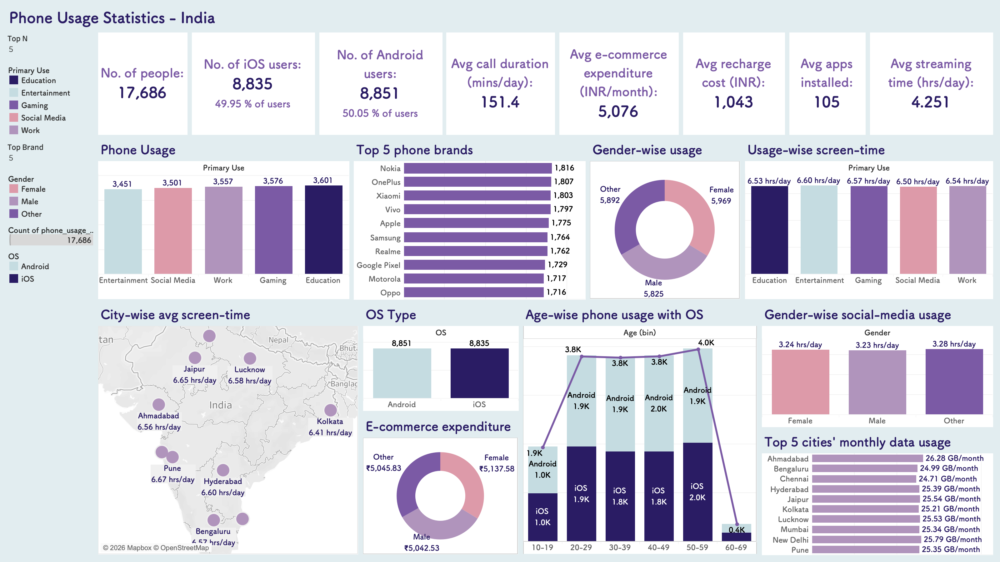

# Phone Usage Analysis Dashboard

An interactive Tableau dashboard for analyzing smartphone usage patterns, user behavior, screen time, app usage, and mobile data consumption. The dashboard enables users to explore various usage trends through interactive visualizations and filters.

---

## Project Overview

The Phone Usage Analysis Dashboard was developed using Tableau to visualize smartphone usage statistics and user behavior. It provides insights into screen time, app usage, mobile data consumption, call duration, recharge expenditure, and demographic trends through an interactive and intuitive dashboard.

This project demonstrates data visualization, dashboard design, and business intelligence techniques for transforming raw user activity data into meaningful insights.

---

## Dataset

- **Source:** Kaggle
- **Domain:** Consumer Analytics
- **Task:** Smartphone Usage Analysis

The dataset contains information related to smartphone usage, including:

- User Demographics
- Age
- Gender
- Operating System
- Device Model
- Screen Time
- Social Media Usage
- Streaming Time
- Call Duration
- Mobile Data Usage
- Monthly Recharge Cost
- Number of Installed Apps
- E-commerce Spending
- Primary Phone Usage
- Location

---

## Dashboard Features

- Interactive Tableau Dashboard
- KPI Cards
- Interactive Filters
- User Demographic Analysis
- Screen Time Analysis
- Operating System Comparison
- Application Usage Analysis
- Mobile Data Consumption Analysis
- City-wise Insights
- Spending Analysis
- Interactive Dashboard Storytelling

---

## Repository Structure

```text
Phone-Usage-Analysis-Dashboard/
│
├── README.md
├── LICENSE
├── .gitignore
├── phone_usage_dashboard.twb
├── phone_usage_india.csv
└── images/
    └── dashboard.png
```

---

## Dashboard Preview

<p align="center">
  
</p>

---

## Dashboard Insights

The dashboard provides insights into:

- Average daily screen time
- Average call duration
- Monthly recharge expenditure
- Mobile data consumption
- Number of installed applications
- Streaming and social media usage
- Smartphone operating system distribution
- Primary phone usage trends
- Gender-based usage comparison
- City-wise mobile data consumption
- User demographics and behavioral patterns

---

## Key Highlights

- Designed a fully interactive Tableau dashboard.
- Visualized smartphone usage trends using multiple chart types.
- Built KPI cards for quick performance monitoring.
- Implemented interactive filters for dynamic data exploration.
- Analyzed user behavior across demographics, operating systems, and locations.
- Created an intuitive dashboard layout for effective storytelling and decision-making.

---

## Tools & Technologies

- Tableau
- Data Visualization
- Dashboard Design
- Business Intelligence

---

## Future Improvements

- Integrate real-time smartphone usage data.
- Add predictive analytics for usage forecasting.
- Expand demographic segmentation.
- Include additional drill-down capabilities and advanced dashboard interactions.

---

## License

This project is licensed under the MIT License. See the **LICENSE** file for details.
